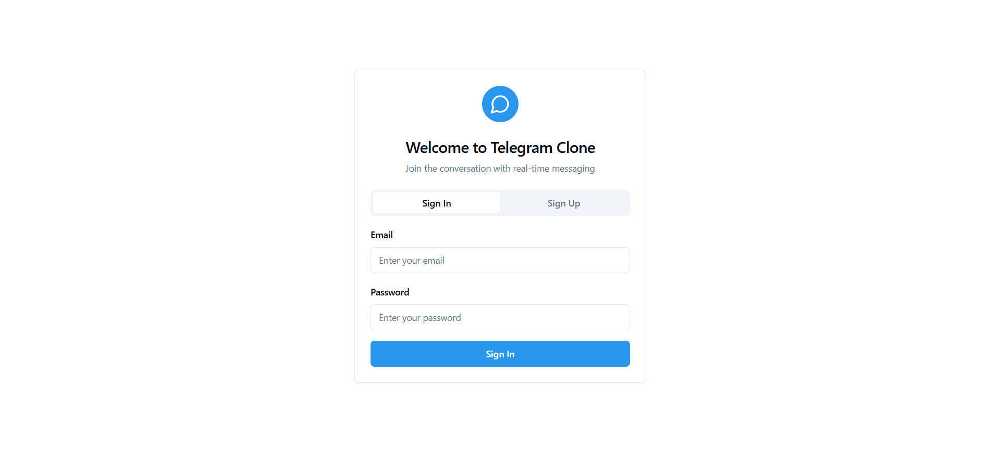

# Supabase Chat App

This is a simple chat application built with React and Supabase.

## Features

- User authentication
- Real-time messaging
- Group chats
- Direct messages

## Setup

1. Clone the repository.
2. Install dependencies: `npm install`
3. Set up your Supabase project and configure the environment variables.
4. Run the development server: `npm run dev`

## Demo

Here's a short demo of the application:

<video controls>
  <source src="demo.mp4" type="video/mp4">
  Your browser does not support the video tag.
</video>
